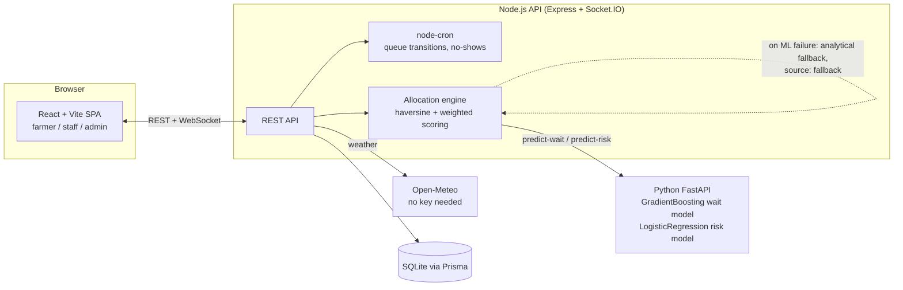

# Procuremintra — Smart MSP Procurement Slot Booking System

A working demo prototype (SIH 2026, PS #26032) of a smart slot-booking system for government MSP crop procurement centres. Runs end-to-end on a laptop, offline-capable, no paid API keys required.

Built for **Team DoomCore** — Smart India Hackathon 2026.

## What it does

- **Farmers** book a procurement slot (by app or by voice), see a quality-risk pre-check before travelling, and track their live queue position.
- **Centre staff** verify arrivals by OTP and move bookings through weighing → processing → payment.
- **Government officials** see arrivals forecasts, centre utilisation, rejection trends, and payment SLA — all on seeded historical data.

The hero feature is the **dynamic allocation algorithm**: every recommendation shows the full weighted-score breakdown (proximity, capacity, queue pressure, predicted wait) so a jury asking "why this centre?" gets the answer on screen, not a black box.

## Architecture



Every prediction/recommendation response carries `"source": "ml" | "fallback"` — if the ML service (or weather API) is down, the API keeps working off analytical formulas and the UI shows that honestly, it never crashes or fakes a number.

## Tech stack

| Layer | Choice |
|---|---|
| Backend | Node.js + Express + Socket.IO |
| DB | SQLite via Prisma |
| ML service | Python + FastAPI + scikit-learn |
| Frontend | React + Vite + TypeScript + Tailwind + Recharts |
| Scheduler | node-cron |

## Quickstart

```bash
npm install          # installs Node deps + bootstraps the Python venv + trains the ML models
npm run seed          # seeds SQLite with 5 centres, 30 farmers, 21 days of history, ~18 live bookings today
npm run dev            # starts api (4000), web (5173), ml (8000) together
```

Then open **http://localhost:5173**. No API keys, no signup, no internet required (weather falls back to a seasonal default offline; voice runs on the browser's built-in Web Speech API).

**Demo logins** (OTP is always `123456` in mock mode, and is shown on screen):
- Any other 10-digit number → **Farmer** (first login prompts profile setup)
- `9999999999` → **Government Admin**
- `8888888888` → **Centre Staff**

To reset to a clean seeded state at any point (useful mid-demo), use the **Reset demo** button on the admin dashboard, or `POST /api/demo/reset`.

## Project layout

```
/apps
  /api          Node + Express + Prisma + Socket.IO
  /web          React + Vite + TS
  /ml           FastAPI + scikit-learn (synthetic-trained models)
/packages
  /shared       shared TS types + the scoring config
/prisma         schema.prisma, seed.ts
```

## The allocation algorithm

`apps/api/src/services/allocation.ts`, weights in `packages/shared/src/scoring.config.ts`:

```
score = 0.35 · proximity − 0.15 · queuePressure
      + 0.30 · capacityScore − 0.20 · waitPressure
```

Every component is normalised to 0–1 before weighting, and the API returns the full per-component breakdown (`rawValue`, `normalised`, `weight`, `contribution`) so the UI can render the "Why this centre?" panel.

## ML models — important caveat

Both models in `apps/ml` (`GradientBoostingRegressor` for wait time, `LogisticRegression` for rejection risk) are trained on **rule-based synthetic data with gaussian noise**, generated by `apps/ml/train.py`. They demonstrate the pipeline (features → prediction → interpretable factor breakdown → graceful fallback) but are **not** trained on real procurement history. Retraining on real data before any pilot deployment is a prerequisite, not an afterthought — the UI labels these as predictions from a synthetic-trained model wherever that caption fits.

## What's intentionally out of scope

Real SMS/payment gateway integration, Aadhaar verification, photo-based quality analysis, ML retraining pipelines, Docker/deployment configs, comprehensive test suites, full UI i18n (voice prompts only), offline-first PWA sync, admin CRUD for centres. See `DECISIONS.md` for build-time decisions and trade-offs.

## Demo script

See `DEMO_SCRIPT.md` for a 4-minute presenter walkthrough.
